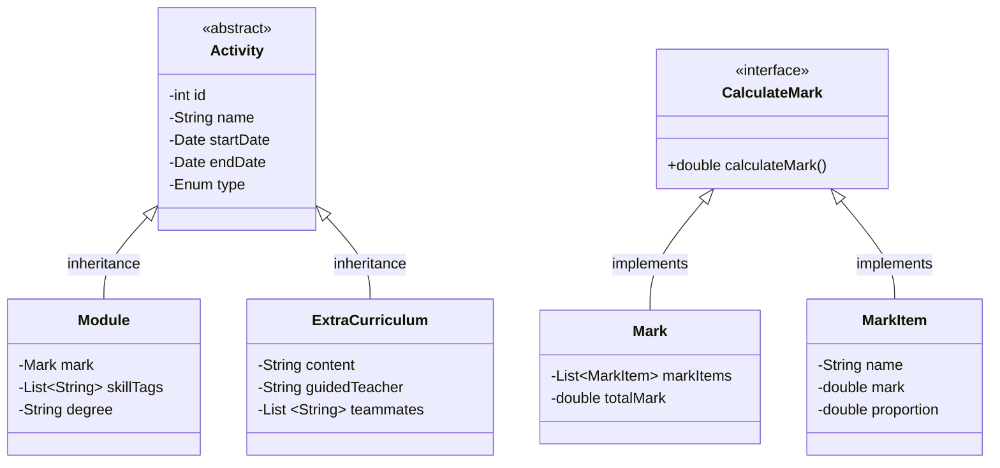

# EduTracker
EduTracker A Learning Journey Application that helps students record and track their academic progress throughout their studies.

## UML

```mermaid
classDiagram
    class Activity {
        -int id
        -String name
        -Date startDate
        -Date endDate
        -Enum type
    }
    <<abstract>> Activity
    
    class Module{
        -Mark mark
        -List~String~ skillTags
        -String degree        
    }
    Activity <|-- Module : inheritance
    
    class CalculateMark{
        +double calculateMark()
    }
    <<interface>> CalculateMark
    
    class Mark{
        -List~MarkItem~ markItems
        -double totalMark
    }
    
    class MarkItem{
        -String name
        -double mark
        -double proportion
    }
    
    CalculateMark <|-- Mark : implements
    CalculateMark <|-- MarkItem : implements
    
    class ExtraCurriculum{
        -String content
        -String guidedTeacher
        -List ~String~ teammates
    }
    
    Activity <|-- ExtraCurriculum : inheritance
```

