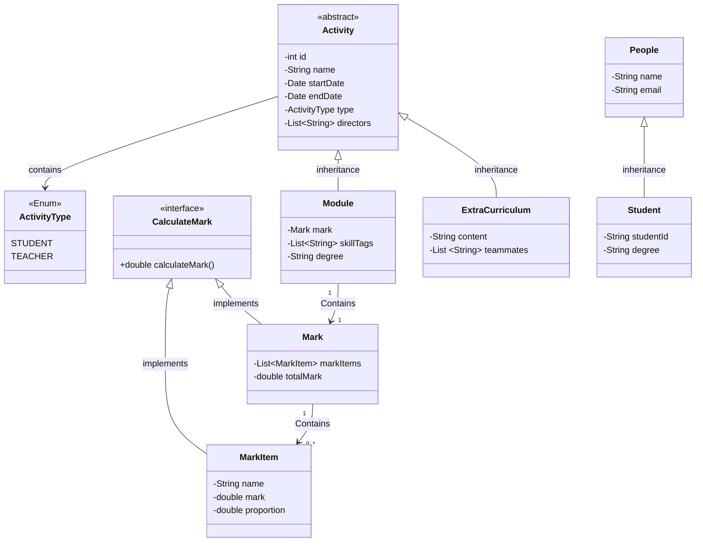

# EduTracker
EduTracker A Learning Journey Application that helps students record and track their academic progress throughout their studies.

## contents

- [EduTracker](#edutracker)
  - [contents](#contents)
  - [UML](#uml)
  - [User Stories](#user-stories)
  - [Backlog](#backlog)

## UML

## User Stories

Functional requirements of user stories:

1. As a student, I want to enter all the course names I have attended so that I can have a detailed knowledge of my uni life.
2. As a student, I want to enter various kinds of skills I acquired not only from courses but also from self-learning projects in the form of tags so that I can have some brief aspects while writing my CV.
3. As a student, I want to record all the academic activities I took part in and their time periods so that I can have a academic timeline
4. As a student, I want to input all course information in a csv file with a fixed template and the system can organize by itself so that I do not need to type every word. (这个可以删)
5. As a group leader, I want to record my group project timeline so that I can easily check the schedule.
6. As a student, I want to enter the overall grade of every course and their credits so that I can easily get the knowledge of my current GPA at any time.
7. As a student, I would like to enter the scores of the various overall sub-items for each course and their proportion of the overall score, so that I can see more visually the composition of the overall grade for the course.
8. As a student, I would like to know all the courses which I should take in the whole 4 years in university, so that I am able to do a little bit of pre-study before I start learning the course.
9. As a student, I would like to know which part of the credits are not enough, so that I can know clearly whether I can graduate without a barrier.
10. As a student, I would like to keep track of all the activities I have participated in and their types, such as academic activities, sports activities, volunteer activities, etc., so that I can look up the activities I have participated in by category.
11. As a student, I would like to change my email address so that I can use the new email.
12.  As a student, I would like to record extracurricular activities, so that it is helpful for me to write a CV in the future.
13.  As a student, I would like to record my group members and instructors information in all the extracurricular activities, so that I can recall who I cooperate with and it will be easy to remember them and make friends with them.
14. As a graduate, I would like to export my academic transcripts so that I can provide them to the ideal universities for my future study.
15. As a student, I would like to enter my roles in courses, such as module representatives so that I can easily get the knowledge of my contributions.
16. As a student, I would like to enter the url of my course notes, posters, and videos under the corresponding module so that I would not forget where I store them and access them easily.
17. As a student, I want to enter the teacher/lecturer information in every course so that I can get in contact with them easily.
18. As a student, I want to record all the prizes and rewards, including the time and detailed content I earned so that I can search them based on the semesters.
19. 

Non-functional requirements of user stories:

1. As a foreign student, I would like to have the choice of setting to native language (not English), so that I can understand what content is on the screen.
2. As a student, I would like to see the change by using statistical data of the course score, in other words, to show the change of score with time by using line charts, so that it can offer me a clear image of my change of status in my study.
3. 

## Backlog

[backlog](https://kdocs.cn/l/cqsVgo0DKAmk)